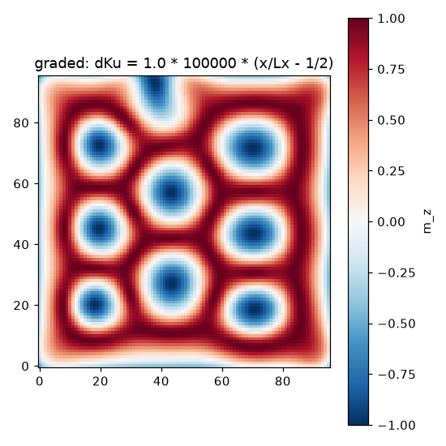

# spinforge

[](https://github.com/JunjianChi/spinforge/actions/workflows/ci.yml)
[](LICENSE)
[](https://github.com/astral-sh/ruff)
[](https://mypy-lang.org/)

**Distributed-memory differentiable micromagnetics.**

spinforge is a finite-difference micromagnetic solver whose forward solve and adjoint both run
across multiple GPUs. The grid is split into slabs. The demagnetizing-field FFT becomes local
transforms plus an all-to-all transpose, neighboring slabs exchange a ghost layer, and every
collective is a `torch.autograd.Function` with its analytic adjoint. Autograd works across ranks
as it does on one device.

The point of this is inverse design. The adjoint method gives the gradient of a simulation
outcome over millions of material parameters for one extra solve, but it must hold the forward
FFT buffers in memory. For a bulk lattice of
[skyrmion](https://www.science.org/doi/10.1126/science.1166767) strings, whose arrangement is set by the
long-range field, that working set exceeds one GPU.

## Install

Python 3.12 or newer is required. CPU is enough for the solver and the full default test suite.
Dependencies are managed with [uv](https://docs.astral.sh/uv/), which installs the exact locked
versions.

```bash
uv sync                 # solver + full default test suite
uv sync --extra mpi     # adds mpi4py for the hand-written CUDA-aware-MPI path
```

The GPU suites were tested on Linux with torch 2.12.1+cu130. The `multigpu` suite also needs
`mpirun` and a CUDA-aware OpenMPI, built with `scripts/build_cuda_aware_ompi.sh`.

## Quickstart

The core is a gradient that flows across GPU boundaries. This runs it on CPU, two ranks standing
in for two GPUs, in a few seconds:

```bash
uv run torchrun --nproc_per_node=2 examples/distributed_adjoint.py
```

```
rank 0 of 2: forward relative error 2.2e-16, gradient relative error 1.8e-16
rank 1 of 2: forward relative error 2.0e-16, gradient relative error 1.7e-16
distributed forward and adjoint both match the single-process solve to roundoff
```

Each rank owns half the magnet, so the demag field and its gradient have to cross the rank
boundary and come back. Against an arbitrary linear functional of the field, the demo checks both
the distributed forward and its gradient against the single-process reference, which is itself
float64-gradchecked, and they agree to roundoff. Existing distributed solvers run the forward
across ranks but their autograd graph breaks at the boundary, so the gradient never crosses. That
is the piece spinforge adds.

## What is implemented

Physics: exchange, bulk DMI with the coupled free-surface boundary condition, demag by a
Newell-tensor FFT convolution, uniaxial anisotropy, Zeeman, Zhang-Li spin-transfer torque.
Fixed-step RK4 with renormalization.

Distributed: differentiable all-to-all and z-halo exchange, the slab demag with optional
real-FFT packing and overlapped communication scheduling, a distributed LLG solver, and
cross-rank gradient checkpointing. A cuFFT demag op and a CUDA-aware-MPI all-to-all build via
CMake or JIT.

Not implemented: finite-temperature stochastic LLG, RKKY multilayers, adaptive time stepping,
multi-node execution.

## Validation

The default test suite reproduces all of this on CPU in about a minute. The multi-rank
distributed checks run as spawned processes:

```bash
uv run pytest -m "not gpu and not multigpu"
```

- Uniform-cube demag field = -Ms/3 to 1e-12, and an analytic skyrmion's topological charge
  Q = -1 to 1e-14.
- [muMAG standard problem 4](results/mumag_sp4.md) mx zero-crossing at 0.138 ns against 0.136 ns,
  the skyrmion-Hall angle to about 5% of the [Thiele prediction](results/skyrmion_hall.md), and
  same-state dynamics matched to [mumax3](results/mumax_crossval.md) at 0.24%, its float32 noise
  level.
- Every collective passes a float64 cross-rank gradient check, multi-rank results match the
  single-process reference within tolerance, and a conservation check runs at runtime.

## Benchmarks

The benchmark times the distributed forward+adjoint step against the same operator on the same
eight GPUs, with correct GPU-direct NCCL communication but naive scheduling. It runs on two GPU
generations, Ampere and Hopper, and the speedup reproduces on both. Conditions:

- 8x NVIDIA A800-SXM4-80GB with NVLink, and 8x NVIDIA H20 with NVSwitch
- 256^3 global grid, float32 compute, strong scaling
- one step is one demag forward plus its adjoint
- mean of 20 timed reps with 95% CI, gated on a single-GPU match

| per step, 8 GPUs | A800 | H20 |
|---|---:|---:|
| unoptimized (ms) | 23.71 ± 0.03 | 12.57 ± 0.02 |
| rfft wire + overlap (ms) | 13.36 ± 0.39 | 6.80 ± 0.01 |
| speedup | 1.77x | 1.85x |

The rfft wire carries most of the gain. Overlap alone gives 1.07x on the A800. At 128^3 adding
GPUs does not help because the step is launch-latency bound. At 512^3 the step time halves with each
doubling of GPUs.

<p align="center">
  
</p>

*Forward+adjoint speedup vs the full-complex single-GPU reference, 8x A800 at 256^3: 5.2x naive,
9.2x with the optimizations on 8 GPUs. The optimized rows cross the ideal line because rfft is an
algorithmic gain the reference lacks.*

The single-GPU working set is 775.7 bytes per cell. One 80 GB GPU fails at 544^3 and eight GPUs
run the same grid at 251 ms per step. The adjoint costs 2.05x the forward step on the H20 and
2.31x on the A800.

Weak scaling, communication decompositions, energy, and the measurement boundaries are in the
full reports [`results/c2_h20.md`](results/c2_h20.md) and [`results/c2_a800.md`](results/c2_a800.md).

## Write a design loop

A design loop is shaped like a training loop: the relaxation is the forward pass and the solver's
adjoint supplies the gradient. The example optimizes a per-cell field profile that nudges a
skyrmion toward a target 5 nm away, on CPU, in a few seconds:

```bash
uv run python examples/design_loop.py
```

```
iter  0  miss = 5.000 nm
...
baseline 5.000 nm -> final 2.624 nm, Q = -0.931
```

The loop itself:

```python
mesh = Mesh(n=(32, 32, 1), dx=(2.5e-9,) * 3)
mat = Material(ms=3.84e5, a_ex=8.78e-12, d=1.58e-3, alpha=1.0)   # FeGe-like
system = System(mesh, mat, demag=True, h_ext=(0.0, 0.0, 2.0e5))
design = torch.zeros(32, 32, dtype=torch.float64, requires_grad=True)

opt = torch.optim.Adam([design], lr=1e5)
for _ in range(iters):
    opt.zero_grad()
    m = relax(m0, design)          # your RK4 loop over system.effective_field, in the example
    loss = objective(m)            # your loss, anything torch can differentiate
    loss.backward()                # gradients flow through every step and field term
    opt.step()
```

Everything is native torch, so the design variable can be the output of an `nn.Module`. The
distributed version swaps `System` for `DistributedSystem` under `torchrun`, with per-rank
z-slabs and `relax(..., checkpoint_every=k)` for the memory-bounded adjoint.

<p align="center">
  
</p>

*The mid-layer m_z of a 96x96x8 skyrmion lattice rearranging under a graded anisotropy profile,
the kind of material parameter the adjoint differentiates through.*

## Prior art

[mumax3](https://mumax.github.io/) is the standard GPU solver for forward simulation. [NeuralMag](https://arxiv.org/abs/2411.11725) and
[magnum.np](https://arxiv.org/abs/2302.08843) are differentiable on one GPU.
[MagneX](https://arxiv.org/abs/2602.12242) and
[magnum.np.distributed](https://arxiv.org/abs/2606.01114) run distributed forward simulation
without gradients. This repo adds the distributed adjoint.

## License

Apache 2.0.
