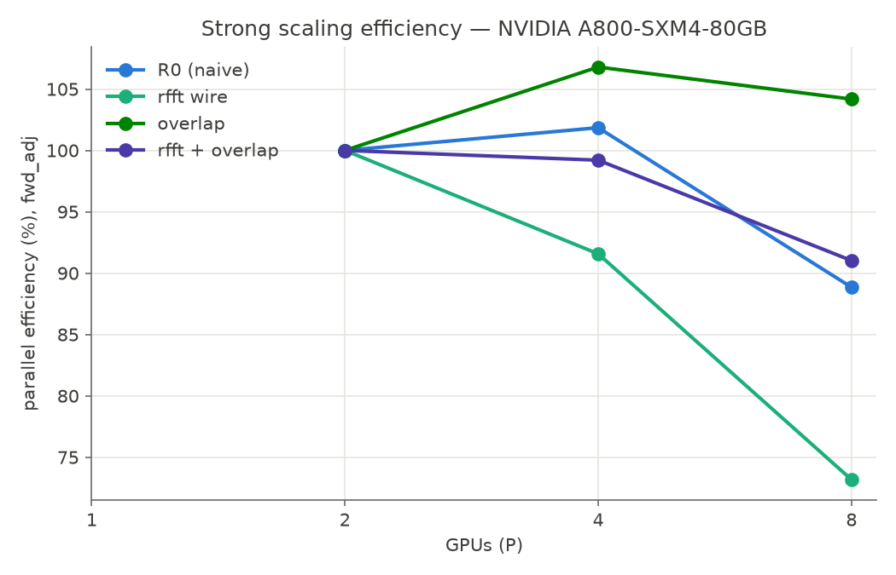
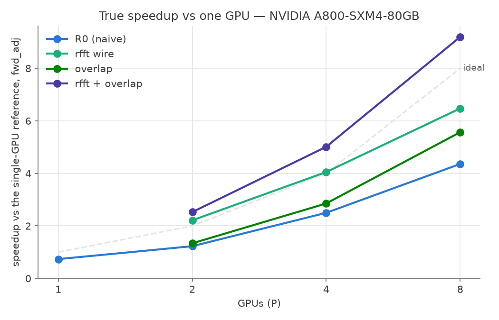
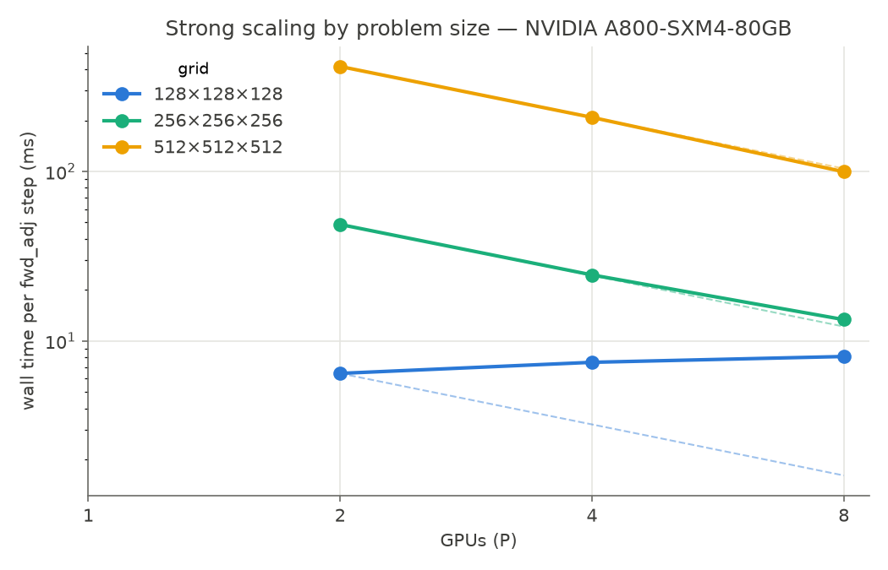
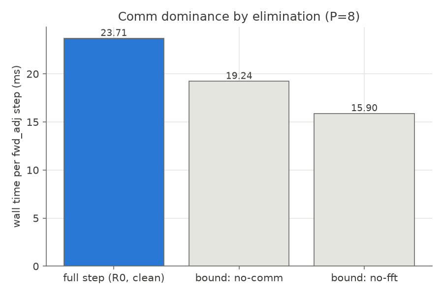
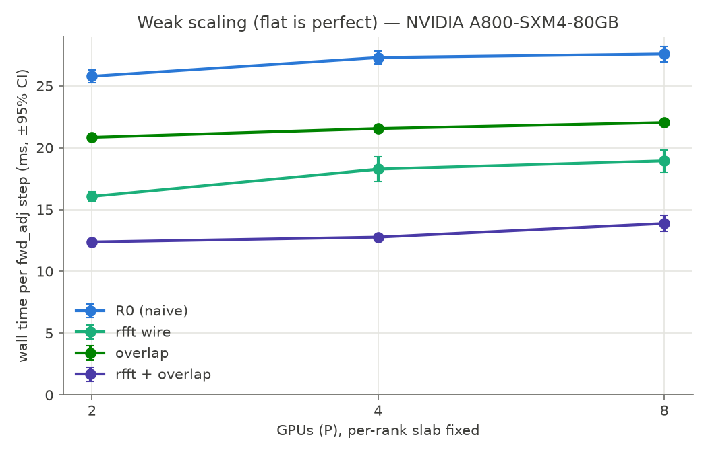

# The full evaluation on A100-class hardware, 8x A800

Hardware: 8x NVIDIA A800-SXM4-80GB on one node. The A800 is the export-market A100, same GA100
silicon with NVLink at 400 GB/s. `topo -m` shows NV8 between every pair. Measured p2p copy is
187 GB/s on near, far, and cross-NUMA pairs alike, 94% of the 200 GB/s unidirectional peak.
Driver 580.126.09, NCCL 2.29.7, torch 2.12.1+cu130, all read from the runs' own environment
records. The measurement discipline is identical to the H20 report: a correctness gate before
every clock, 20 repetitions after 4 warmups, 95% confidence intervals, per-repetition maximum
over ranks, raw samples in every JSON. Companion report: `c2_h20.md`. Every figure names its
machine in the title. R0 denotes the naive-scheduled GPU-direct NCCL baseline.

## Timing-instrument bias, second machine

Instrumented blocking R0 against the uninstrumented shipped backend at P=8: 28.16 versus
23.71 ms, a bias of 18.8%. The direction matches the H20 (+11.5%) and the magnitude is larger.
Every speedup below uses the clean 23.71 ms denominator. Instrumented rows are kept for phase
attribution and never compared across machines.

## Wall time per forward+adjoint step, strong scaling, 256^3

| row | P=2 | P=4 | P=8 | speedup at P=8 |
|---|---:|---:|---:|---:|
| R0 naive (instrumented / clean) | 100.2 | 49.2 | 28.2 / 23.71 | 1.00x |
| rfft wire (instrumented / clean) | 55.6 | 30.3 | 18.98 / 14.62 | 1.62x |
| f32 wire (not exercised, see Not measured) | 97.3 | 45.9 | 23.65 | n/a |
| overlap (clean) | 92.0 | 43.1 | 22.08 | 1.07x |
| rfft + overlap (clean) | 48.66 | 24.53 | 13.36 ± 0.39 | 1.77x |

P=2 and P=4 cells are the matrix runs, instrumented where the row's backend is metered. The P=8
column carries the clean reruns. The cumulative row's last samples drift from 13.4 to 15.4 ms
and the CI is widened accordingly. The full stack runs the step 1.77x faster than the
unoptimized baseline, against 1.85x on the H20. Per-row strong-scaling efficiency:

## Speedup against one GPU

The single-GPU reference (full-complex FFT) takes 16.1 ms at 128^3, 52.6 ms at 192^3, and
122.9 ms at 256^3 per forward+adjoint step.

The distributed operator on a single rank takes 167.1 ms, 36% more than the plain single-GPU
solver. It is shown at P=1 and is never a denominator. Naive R0 reaches 4.4x on 8 GPUs, 5.2x
with the clean wall. The optimized stack reaches 9.2x. It crosses the ideal line because the
rfft wire is an algorithmic gain the serial reference does not have. The overlap row, a pure
scheduling change, stays below ideal. The single-GPU adjoint costs 2.12x the forward step (58 to
122.9 ms). Distributed it costs 2.31x (12.23 to 28.20, same meter), the second all-to-all plus
pack and reshape work that is relatively slower on this generation.

## Strong scaling by problem size

| grid | P=2 to P=4 to P=8, optimized stack (ms) | regime |
|---|---|---|
| 128^3 | 6.4, 7.5, 8.1 | adding GPUs does not help, the step is launch-latency bound |
| 256^3 | 48.7, 24.5, 13.4 | transition |
| 512^3 | 416, 208, 99.6 | near-ideal halving per doubling. 512^3 does not fit one GPU (104 GB against 80), so only the multi-GPU curve exists |

## Capacity wall

The single-GPU working set is linear at 775.7 bytes per cell, with a fit residual of 0.05 GB
over 192^3 to 320^3. Against the card's 79.25 GiB, 448^3 fits (about 70 GB predicted) and 480^3
does not (about 86 GB), so the wall sits between them. Boundary evidence: one GPU at 544^3 hits
CUDA out-of-memory, and 8 GPUs run the
same 544^3 grid at 251 ± 0.1 ms per forward+adjoint step with the correctness gate passed.

## Communication share by elimination, and an overturned prediction

Replacing the collective with an identity leaves 19.24 ms. Replacing the FFTs with stand-ins
leaves 15.90 ms. Against the clean 23.71 ms step, communication accounts for 4.47 ms (18.9%),
FFT for 7.81 ms (32.9%), and the remainder (pack, reshape, multiply, launch) for 11.43 ms
(48.2%). The decomposition closes exactly on this machine as it did on the H20.

We expected the A800's halved link bandwidth to raise the communication fraction and enlarge
the optimization win. The measurement says otherwise. Communication is 1.40x slower than on the
H20 while FFT is 1.86x and pack/reshape 2.20x slower. Compute degrades more than the wire, the
communication fraction falls (18.9% against 25.4%), and the cumulative win is accordingly a
little smaller (1.77x against 1.85x). The communication fraction is set by the whole machine's
compute-to-communication balance, not by the link alone.

## Machine parameters and the NCCL-efficiency anchor

Fitted alpha is 26 to 93 us per message and beta is 89 to 134 GB/s per rank, on 16 to 256 MB
payloads. NCCL all-to-all delivers 72% of measured p2p here (134/187) and 73% on the H20
(288/394), the same implementation efficiency on both fabrics. As on the H20, the fitted
per-message alpha does not serialize under NCCL's pipelined all-to-all, a limitation of the
model.

## Weak scaling, per-rank slab fixed

R0 goes from 25.8 to 27.6 ms over 2 to 8 ranks (+7.0%, the H20 read +6.7%). The optimized stack
goes from 12.4 to 13.9 ms (+12%, against +4.4% on the H20). The lower-bandwidth fabric feels the
growing per-rank wire volume more. 

## Energy

Mean per-GPU draw was sampled at 1 Hz over identical benchmark windows and multiplied by the
same runs' step times. Naive: 99 W at 23.79 ms per step. Optimized: 85 W at 15.25 ms. Across 8
GPUs that is about 18.8 versus 10.4 J per step, a factor of 1.8. The method is coarse (the
window includes setup), so the ratio is the claim, not the absolute joules.

## Not measured

- cuFFTMp and heFFTe: no comparison exists. No claim is made in either direction.
- Multi-node: single node only.
- The CUDA-aware-MPI collective was validated on an RTX 4060 and on the H20 (blocking,
  Ialltoall, and pairwise variants bit-identical). It was not rebuilt on this machine. The
  results here are NCCL-path and do not depend on it.
- nsys was unavailable on this image too. The overlap claim is carried by wall time and CI.
- The f32-wire row was not exercised. It ran at float32 compute, where the wire cast is an
  identity (wire bytes identical to R0 in the raw JSONs, 704.64 MB both). The harness now
  refuses this configuration and the matrix script runs the row at f64 compute. Gradient
  tolerances for a real mixed run are rtol 2e-2 and atol 1e-3, against the strict float64 tier
  at 1e-5 and 1e-6.
- The single-GPU denominator is the full-complex reference. The above-ideal crossing of the
  optimized rows is the algorithmic rfft gain, stated where shown.
- Rankings hold for the two generations measured, Ampere-class and Hopper-class.

Reproduce with `scripts/run_session2.sh`, `scripts/run_c2_matrix.sh`, and
`scripts/run_size_energy.sh` (the size grid and energy sections). Figures regenerate with
`benchmarks/plot_c2.py`. Raw JSONs for the headline cells are in `results/raw/`.
