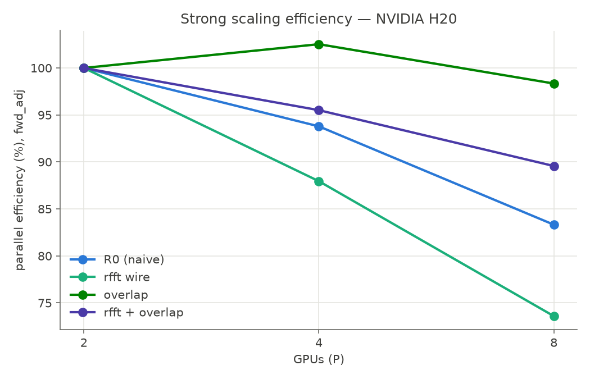
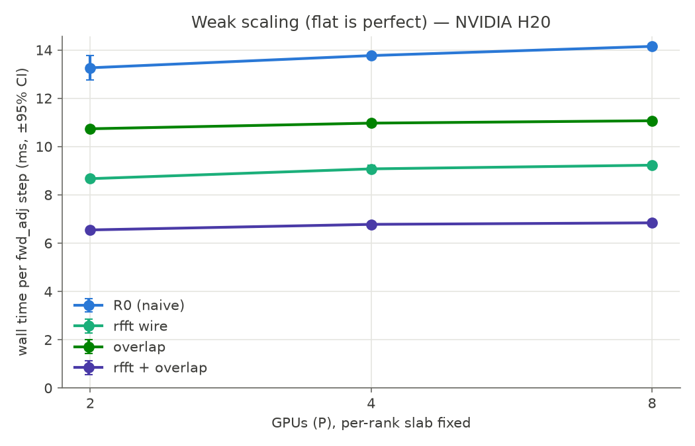
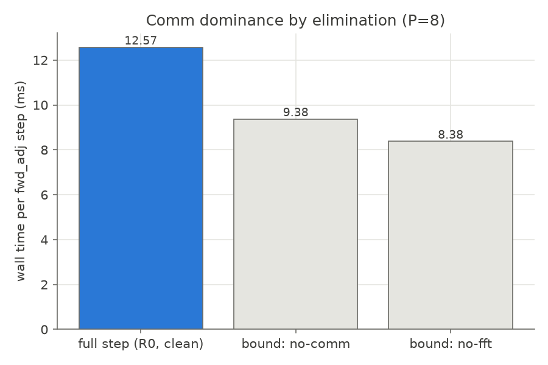

# Communication optimization of the distributed adjoint, 8x H20

Hardware: 8x NVIDIA H20 96 GB on one node, NVSwitch all-to-all (`nvidia-smi topo -m` shows NV18
between every pair). Measured p2p copy is 394 GB/s, identical for near and far pairs. Driver
580.65.06, torch 2.12.1+cu130. Compute is float32. The strong-scaling grid is 256^3 global. The
weak-scaling grid is 256x256x32 per rank. Every cell runs a correctness gate before the timer,
then 20 repetitions after 4 warmups. Reported walls are the per-repetition maximum over ranks,
with a 95% confidence interval. Raw samples are in `results/raw/`. The rankings hold for this
hardware generation and are not claimed to transfer. R0 denotes the naive-scheduled GPU-direct
NCCL baseline, the honest denominator for every speedup below.

## Timing-instrument bias

R0 was measured two ways at P=8, back to back: through the instrumented blocking collective and
through the uninstrumented shipped backend. The results are 14.01 ± 0.03 ms and 12.57 ± 0.02 ms.
The instrument's per-collective synchronization costs 11.5%. The matrix's own instrumented R0 row
reads 14.12 ± 0.08, a separate run consistent with the pair. All speedups below use the
uninstrumented 12.57 ms as the denominator. Instrumented rows are kept for phase attribution and
carry about 1.4 ms of instrument overhead, so they are upper bounds on their clean times.

## Wall time per forward+adjoint step, strong scaling, 256^3

| row | P=2 | P=4 | P=8 | speedup at P=8 |
|---|---:|---:|---:|---:|
| R0 naive (instrumented / clean) | 47.07 | 25.10 | 14.12 / 12.57 | 1.00x |
| rfft wire (instrumented) | 27.23 | 15.48 | 9.25 | at least 1.36x, about 1.6x clean |
| f32 wire (not exercised, see Not measured) | 45.39 | 23.57 | 12.58 | n/a |
| overlap (clean) | 43.55 | 21.24 | 11.07 | 1.14x |
| rfft + overlap (clean) | 24.35 | 12.75 | 6.80 ± 0.01 | 1.85x |

The full optimization stack runs the step 1.85x faster than the unoptimized baseline. The rfft
wire is the largest single lever. It halves the wire bytes and also shrinks the packed spectral
grid's z-FFT and pack work. Overlap contributes little alone at this size (the communication
fraction is about 25%, which caps any overlap gain at 1.33x) but composes with rfft.

Strong-scaling efficiency, each row against its own P=2: the overlap row holds 98 to 102% while
R0 decays to 83%. The growing communication share is absorbed into the compute window. The
overlap point above 100% at P=4 (102.5%, CI far smaller than the excess) is mild real
superlinearity: halving the per-rank slab improves cache residency of the local FFT stages.

## Weak scaling, 256x256x32 per rank

R0 goes 13.26 to 13.77 to 14.15 ms from 2 to 8 ranks (+6.7%). rfft + overlap goes 6.55 to 6.78
to 6.84 ms (+4.4%). 

## The adjoint's cost, P=8, strong grid, R0

Forward is 6.90 ms. Forward plus adjoint is 14.12 ms, a factor of 2.05. The adjoint transpose is
a second all-to-all, so the collective count doubles, and the wall time follows. Adding
checkpoint recompute gives 18.44 ms, a factor of 2.67 over forward, inside the (2N, 3N] band the
traffic tests pin.

## Communication share by elimination, P=8

Both bound variants run on the uninstrumented backend (their `pack_ms` reads zero), so they
compare directly to the clean 12.57 ms step. Replacing the collective with an identity leaves
9.38 ms. Replacing the FFTs with stand-ins leaves 8.38 ms. A perfect communication optimization
could therefore save at most 3.19 ms (25%) and a perfect local-FFT optimization at most 4.19 ms
(33%). The decomposition closes exactly: communication 3.19 + FFT 4.19 + remainder (pack,
reshape, multiply, launch) 5.19 = 12.57 ms. The cumulative row beats both single-lever ceilings
because rfft cuts wire and compute together.

## Machine parameters, alpha-beta fit on 16 to 256 MB payloads

Fitted alpha is 18 to 77 us per message and beta is 290 to 406 GB/s per rank, consistent with
the 394 GB/s p2p probe. At the strong-scaling operating point the bytes-only bound is about
2.4 ms per step against a measured communication share of about 3.19 ms, so the wire term
matches. Adding the fitted alpha term predicts about 3.9 ms, 20% above the measurement. The
per-message alpha does not serialize under NCCL's pipelined all-to-all, so the fitted alpha
overestimates at this message size. This is a limitation of the model, not of the measurement.
The conclusion stands: the transpose sits near the wire's byte roofline, so byte reduction is
the correct lever family. Payload sweeps below 16 MB are launch-jitter dominated on this fabric
and the fitter rejects them.

## Also validated this session

The correctness gates passed at P=2 and P=8, validated beforehand on CPU processes and a single
GPU. The CUDA-aware MPI
extension compiled and passed its cross-GPU tests at np=2, including the MPI_Ialltoall probe on
NVLink. The np=8 failure was a fixed-size test grid that does not divide by 8, fixed in the same
commit. P=6 was not measured because 256-cell grids do not divide by 6.

## Not measured

- cuFFTMp and heFFTe: no comparison was run. This report makes no claim relative to either
  library in any direction. The wire-roofline fraction above is the absolute-efficiency
  statement.
- Multi-node: everything here is one NVSwitch node. Nothing is claimed about interconnects.
- The f32-wire row was not actually exercised. It ran at float32 compute, where casting the
  payload to a float32 wire is an identity, so the wire bytes were unchanged (identical to R0 in
  the raw JSONs). Its wall time measured the cast overhead, not the lever. A real f64-compute
  measurement was not taken this session, and the harness now refuses the no-op configuration.
  The gradient path for a real mixed run is validated in the test suite at rtol 2e-2 and atol
  1e-3, against the strict float64 tier at 1e-5 and 1e-6.
- The overlap mechanism is carried by wall time and CI, not by an Nsight timeline. nsys was
  unavailable on the rented image. `CUDA_DEVICE_MAX_CONNECTIONS` was recorded but not swept.
- Every number above is H20. The companion report `c2_a800.md` covers A100-class hardware, and
  rankings are not claimed beyond those two generations.

Reproduce with `scripts/run_c2_matrix.sh` (SMOKE=1 gives a CPU wiring check). Figures regenerate
with `benchmarks/plot_c2.py`. Raw summaries for the headline cells of both machines are in
`results/raw/`.
