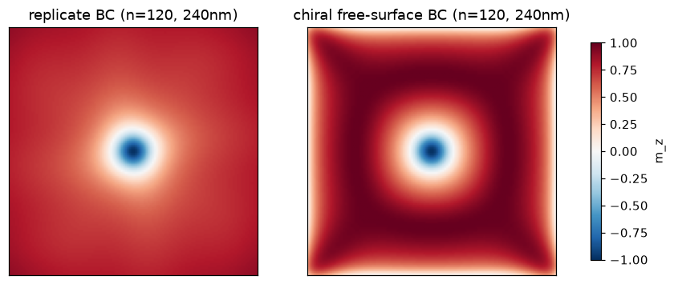

# The free-surface DMI boundary condition and the chiral surface twist

Bulk (B20) DMI and exchange are not separable at a free surface. Minimizing
`E = integral of A|grad m|^2 + D m.(curl m)` gives a single natural boundary condition,

> dm/dn = (D/2A)(n x m), with n the outward normal,

which reduces to Neumann at D=0. Imposing the terms separately (Neumann for exchange, replicate
for DMI) clamps the edge. `core/chiral.py` implements the coupled operator: the exchange
Laplacian and the DMI curl are padded with the same chiral ghost cells, and `System` uses it
whenever A and D are both nonzero. It passes a float64 gradient check and matches
`exchange + bulk_dmi` in the interior, where only the edge layer carries the boundary condition.
Reference for the interfacial form: Rohart and Thiaville, PRB 88, 184422 (2013). The bulk-DMI
analogue is used here.

## What it changes

A relaxed FeGe-class skyrmion (A=8.78e-12, D=1.58e-3, Ms=3.84e5, 0.4 T bias, helical length
L_D = 4 pi A / D of about 70 nm). Box-integrated Q and edge mean m_z against box size:

| box | replicate Q | chiral Q | replicate edge mean m_z | chiral edge mean m_z |
|---:|---:|---:|---:|---:|
| 100 nm | -0.766 | -0.727 | +0.633 | +0.401 |
| 160 nm | -0.862 | -0.727 | +0.774 | +0.245 |
| 240 nm | -0.904 | -0.734 | +0.814 | +0.167 |

The render (240 nm box) decides it. With the replicate boundary the picture is a clean isolated
skyrmion in a uniform +z sea, and box-Q marches toward -1 as the box grows. With the chiral
boundary the same core is surrounded by a smooth, four-fold-symmetric edge band where m_z twists
in-plane, strongest at the corners. That band is the chiral surface twist of cubic helimagnets
at a free boundary. It is smooth and symmetric, physics rather than a discretization artifact.

An earlier assumption in this project said the free-surface condition plus a larger box would
sharpen Q toward -1. The opposite is true. The replicate boundary clamps the edge to the
background, so its march to -1 is an artifact of suppressing the real twist. The correct
boundary keeps the twist, box-Q plateaus near -0.73 here, and the edge tilts further in-plane as
the box grows. With L_D of about 70 nm comparable to the box, the twist is a wide band rather
than a thin ring, so it is not a vanishing edge correction at these sizes.

## Consequences

- The default `System` carries the coupled free-surface boundary condition. The standalone
  `bulk_dmi_field` and `exchange_field` remain for single-term cases and as references.
- Box-integrated Q is not a clean -1 for a confined bulk-DMI skyrmion, and that is correct. Use
  Q as a localized-winding diagnostic, not as a should-equal-minus-one gate.
- For a bulk skyrmion-string lattice the surface twist is part of the physics. Clamping it away
  would be the fidelity error.
