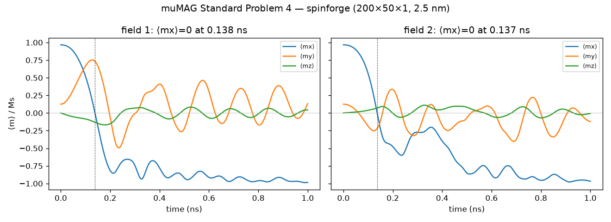

# muMAG standard problem 4, dynamic reversal

The community benchmark for dynamic micromagnetics. It exercises the full low-damping LLG
(exchange, demag, Zeeman, precession, Gilbert ringing) end to end against an external reference
rather than a single static field term. Permalloy film 500 x 125 x 3 nm, A = 1.3e-11 J/m,
Ms = 8e5 A/m, K = 0, alpha = 0.02. Relax to the equilibrium S-state (saturate along [1,1,1],
relax at zero field), then apply the reversal field instantaneously and record the mean
magnetization over 1 ns (`experiments/mumag_sp4.py`, RTX 4060). The grid is 200 x 50 x 1 with
2.5 nm cells, the same grid the canonical mumax3 and OOMMF comparisons use. Specification and
reference: https://www.ctcms.nist.gov/~rdm/std4/spec4.html.

| quantity | spinforge | reference |
|---|---|---|
| S-state mean m | (0.967, 0.125, 0.000) | mostly +x, small +y, mean mz near 0 |
| field 1 mx zero crossing | 0.138 ns | about 0.136 ns (muMAG, OOMMF) |
| field 2 mx zero crossing | 0.137 ns | 0.13 to 0.14 ns |
| field 1 final mean m | (-0.984, 0.133, 0.043) | reversed |
| field 2 final mean m | (-0.968, -0.121, -0.006) | reversed |

## Verdict: pass

- The field 1 zero crossing lands at 0.138 ns against the 0.136 ns reference, within about 2%,
  inside the known spread between codes. The full trajectory shape matches the published curves:
  mx falls monotonically through zero and rings down to -1, my overshoots to about 0.75 and
  decays, mz shows the small precessional out-of-plane oscillation.
- Field 2 reproduces the characteristic double-dip reversal of the 36 mT, 190 degree case.
- This validates the dynamic solver. The static oracles (uniform-cube demag, Larmor frequency,
  relax to easy axis) do not cover precession and ringing.

## Method notes

- Fixed-step RK4 at dt = 1e-13 s with renormalization each step, the production solver. The
  fastest resolved mode is the 2.5 nm exchange precession (omega times dt about 0.9, inside RK4
  stability). The physical reversal near 0.1 ns is oversampled about 1000x. OOMMF and mumax use
  adaptive integrators. Fixed-step RK4 lands on the same answer, so the timing is not an
  artifact of an adaptive controller.
- The S-state counts as converged when the maximum normalized torque falls below 1e-4, reached
  by about 7500 relaxation steps at alpha = 1.
- Gamma here is the free-electron value 2.2128e5 m/(A s). The muMAG value 2.211e5 differs by
  0.08%, far below the discretization error.
- Reproduce with `python experiments/mumag_sp4.py --cuda --out sp4.npz --plot fig.png`. Replot
  with `--from-npz sp4.npz --plot fig.png`. A reduced CPU version runs in CI as a slow test.
