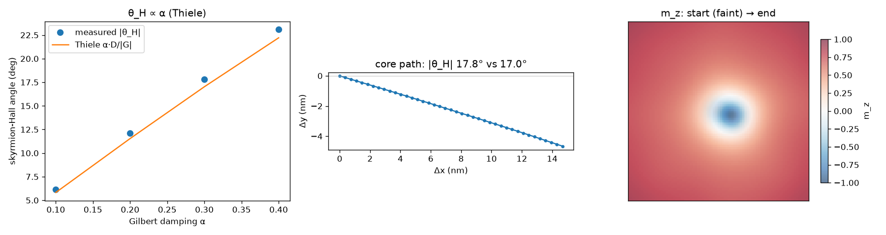

# Current-driven skyrmion transport and the Hall angle

Under a spin-transfer-torque current a skyrmion does not move along the current. The gyrotropic
force deflects it by the skyrmion Hall angle, the effect that drives skyrmions into track edges
in racetrack devices. The solver carries the adiabatic Zhang-Li term `-(u.grad)m` (xi = 0,
`core/spin_torque.py`, gradient-checked), and this report checks the deflection against the
Thiele equation.

Setup: a relaxed FeGe-class skyrmion (A=8.78e-12, D=1.58e-3, Ms=3.84e5, 0.4 T bias) in a clean
uniform background with replicate boundaries (the chiral edge twist is validated separately in
`dmi_surface_twist.md`), driven by u = (80, 0, 0) m/s. The Thiele prediction
tan(theta_H) = alpha D / G uses the gyrocoupling G and dissipative tensor D read off the relaxed
texture. The area element and the Ms over gamma prefactor cancel in the ratio. The velocity is
fit from the tracked core centroid (`experiments/skyrmion_hall.py`, RTX 4060).

From the relaxed skyrmion: G = -9.91, the right sign and order for 4 pi Q as a sanity check, and D/|G| = 1.021.

| alpha | measured theta_H | Thiele theta_H | speed |
|---:|---:|---:|---:|
| 0.10 | 6.12 deg | 5.83 deg | 80.6 m/s |
| 0.20 | 12.13 deg | 11.54 deg | 79.3 m/s |
| 0.30 | 17.80 deg | 17.02 deg | 77.1 m/s |
| 0.40 | 23.09 deg | 22.21 deg | 74.5 m/s |

## Verdict: pass

- The Hall angle is linear in alpha and tracks the Thiele line to about 5% across the sweep. The
  consistent 5% excess is the rigid-Thiele approximation: the driven skyrmion deforms slightly
  while D and G are read from the static profile.
- The deflection is toward -y for the +x drive, as the negative-Q gyrovector requires, with the
  same sign across the sweep. The core path is a straight line at the Hall angle.
- Speed falls with alpha (80.6 to 74.5 m/s), the Thiele dissipative slowdown as damping grows.
- The skyrmion stays intact while moving. The rendered start and end states show a localized
  core in a uniform sea, not deformed, split, or annihilated, so the scalar Hall angle is
  trustworthy.

## Scope

This validates the forward current-driven physics. The idealized setup has replicate boundaries
and no pinning. Edge interaction, disorder pinning, and the non-adiabatic beta torque are not
implemented.
